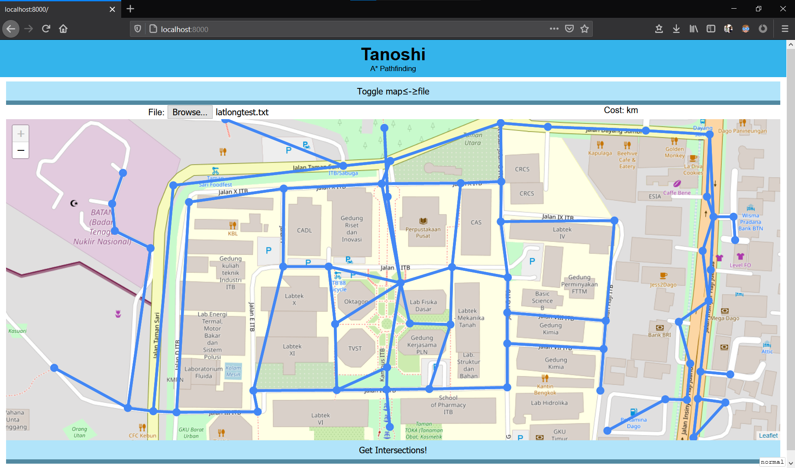

# Tanoshi
Implementasi algoritma A* dalam menentukan jalan.

## Isi
- [Tanoshi](#tanoshi)
  - [Isi](#isi)
  - [Deskripsi Umum](#deskripsi-umum)
  - [Teknologi yang Digunakan](#teknologi-yang-digunakan)
  - [Persiapan/Menjalankan Program](#persiapanmenjalankan-program)
  - [Detil Penggunaan](#detil-penggunaan)
  - [Format berkas masukan](#format-berkas-masukan)
  - [Demo](#demo)
  - [Author](#author)
## Deskripsi Umum
Proyek ini adalah proyek yang menggunakan algoritma A* pada graf untuk mencari
jalan terpendek antar dua simpul. Proyek ini ditulis dengan bahasa golang.
Modul graf proyek ini dapat digunakan secara independen, namun implementasi
interaksi dengan pengguna dibuat terkait dengan teknologi web, menggunakan
wasm.
Proyek ini dibuat sebagai bagian dari penugasan dalam mata kuliah IF2211
Strategi Algoritma tahun 2021.

## Teknologi yang Digunakan
- [Overpass API](https://wiki.openstreetmap.org/wiki/Overpass_API)
- [Golang](https://golang.org)
  - [syscalls/js](https://golang.org/pkg/syscalls/js)
  - [Overpass-Go](https://github.com/serjvanilla/overpass)
  - [mercator](https://github.com/davvo/mercator)
- [WebAssembly](https://webassembly.org)
- [Leaflet](https://leafletjs.com)
- [Sigma js](https://sigmajs.org)

## Persiapan/Menjalankan Program
Kompilasi modul graf dapat dilakukan dimana saja, namun untuk menjalankan UI
web disarankan menggunakan OS Linux atau menggunakan msys2 di windows.

1. [Install go](https://golang.org/dl)
2. Install dependency: `go mod download`
3. Jalankan program:
  1. Dengan Linux atau msys2:
    1. Atur `WASM_EXEC`: `export WASM_EXEC="$(go env GOROOT)/misc/wasm/wasm_exec.js"`
    2. `make run`
  2. Dengan Windows dan PowerShell:
    1. buat folder out: `mkdir out`
    2. copy file `wasm_exec.js` dari GOROOT ke out: `cp "$(go env GOROOT)/misc/wasm/wasm_exec.js" out/`
    3. compile `main.go`: `$env:GOOS="js"; $env:GOARCH="wasm"; go build -o out/main.wasm main/main.wasm`
    4. jalankan server, serve out: `go run server.go -dir=out`


## Detil Penggunaan
Antarmuka web dibagi 2 bagian besar, yaitu dengan map dan tanpa map. untuk
bagian tanpa map penggunaannya cukup _straightforward_, yaitu dengan (0.)
Memilih mode graf (planar = jarak euclidean, globe = jarak geodesic) (1.)
Memilih berkas yang akan dibaca, (2.) Memilih node asal dan tujuan, dan
terakhir (3.) Mengklik tombol `Go!` supaya algoritma A* dieksekusi.
Untuk penggunaan bagian dengan map, input graf lagi-lagi dapat diambil dari
berkas, seperti pada (1.). Namun juga, input dapat diambil secara otomatis
dengan mengklik `Get Intersection!`, yang akan mengambil semua persimpangan
yang terlihat di layar. untuk memilih node awal dan tujuan, klik pada
lingkaran yang merepresentasikan node. Algoritma akan jalan secara otomatis
untuk setiap 2 node yang terpilih.

Untuk membuat berkas masukan, gunakan alat `nodemaker.html`. Cara mengaksesnya
adalah dengan mengakses `localhost:8000/nodemaker.html` setelah menjalankan
sesuai dengan [instruksi](#persiapanmenjalankan-program). Penggunaan alat
tersebut cukup sederhana, yaitu memasuki mode tambah node dengan mengklik
`add node`, lalu mengklik titik-titik yang akan dijadikan node di peta.
Selanjutnya, pembuatan edge antar node dapat dilakukan dengan mengklik
`add edge`. Sistem penambahan edge adalah mengklik node awal, lalu mengklik
node selanjutnya. Node selanjutnya kemudian dijadikan sebagai node awal, dan
proses diulang. Jika ingin menghapus node, gunakan `remove node` lalu klik node
yang ingin dihapus. Jika ingin menghapus edge, gunakan `remove edge` lalu klik
kedua node yang dihubungkan oleh edge. Jika ingin menghapus graf, klik `clear`.
Jika sudah selesai, maka graf dapat di-export dengan mengklik `export`.

## Format berkas masukan
Format berkas masukan yang digunakan:
```
<jumlah node>
<lat/x node 1> <lon/y node 1> <nama node>
...
<matriks adjacency>
```

## Demo
Load without map:

Pathfinding without map:

Load with map:

Pathfinding with map:

Load from API:

Pathfinding from API:


## Author
Fransiskus Febryan Suryawan - 13519124